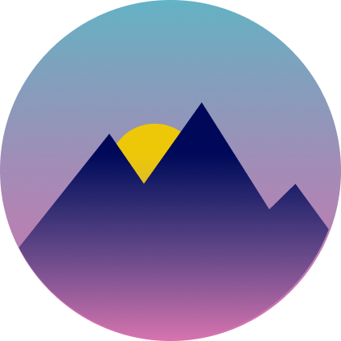
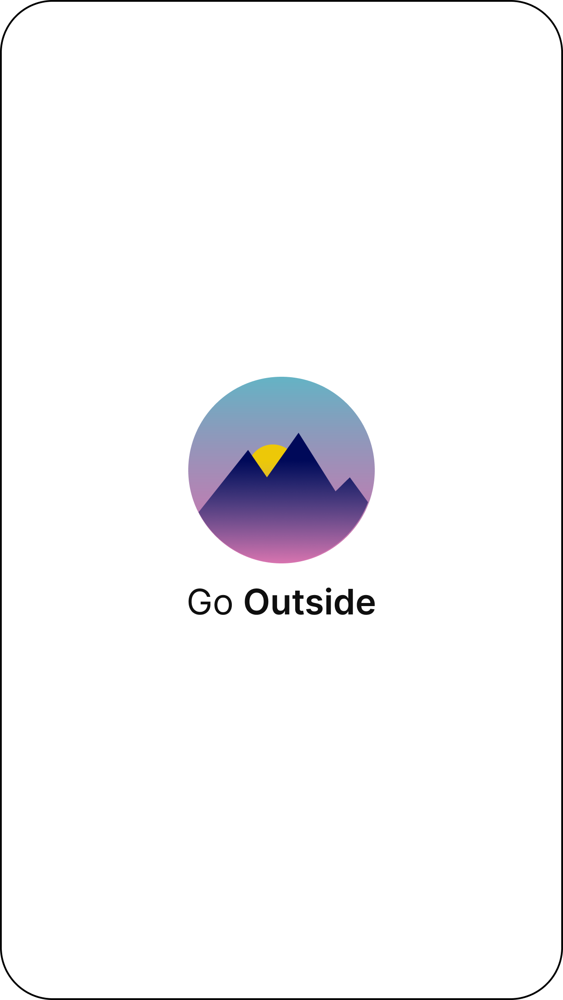
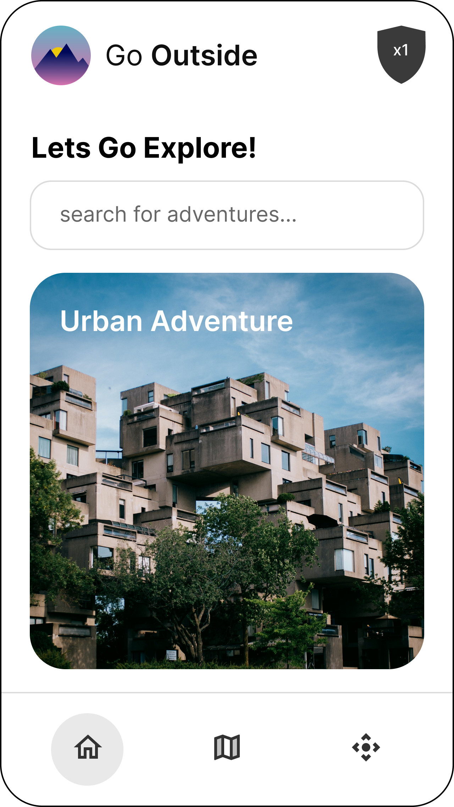
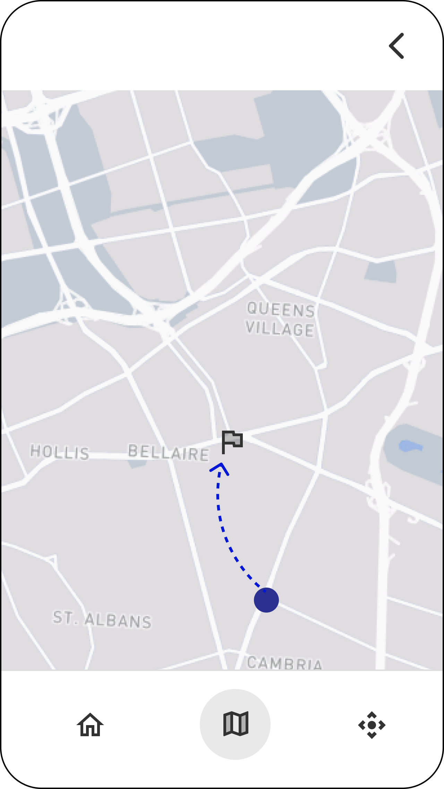
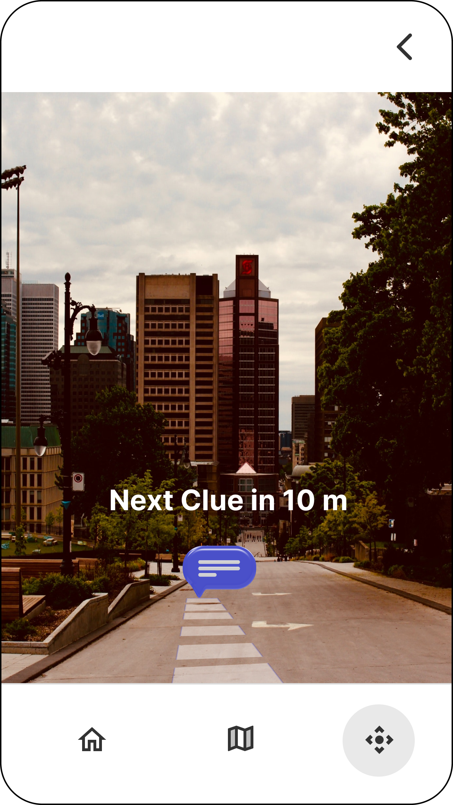
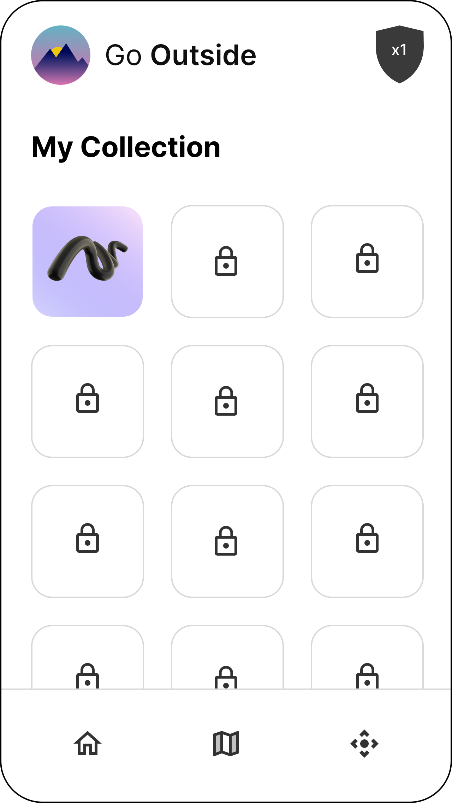

<p align="center">
  <a href="https://github.com/KrisTheCanadian/GoOutside">
  
    <h1 align="center">Go Outside</h1>
  </a>
</p>

<p align="center">
  <a aria-label="Github" href="https://github.com/KrisTheCanadian/GoOutside">
    
  </a>
  <a aria-label="Android" href="https://www.android.com/intl/en_ca/">
    
  </a>
  <a aria-label="Kotlin" href="https://kotlinlang.org/">
    
  </a>
      <a aria-label="markdown" href="https://www.markdownguide.org/">
    
  </a>
</p>

<p align="center">
  <a aria-label="Figma" href="https://www.figma.com">
    
  </a>
  <a aria-label="Android Studio" href="https://developer.android.com/studio">
    
  </a>
  <a aria-label="GitKraken" href="https://www.gitkraken.com/">
    
  </a>
  <a aria-label="Google Cloud" href="https://cloud.google.com/">
    
  </a>
    <a aria-label="VSCode" href="https://code.visualstudio.com/">
    
  </a>
    </a>
    <a aria-label="Gradle" href="https://gradle.org/">
    
  </a>
    </a>
</p>

<br>**Go Outside is an augmented reality app designed for our team's Software Engineering UI/UX class. This app serves as a PROTOTYPE to demonstrate how it would work if we had many users and a real time database using firebase, meaning it is not fully featured or functional due to the project time constrains.<br>

# Project Information 🚀

[](http://perso.crans.org/besson/LICENSE.html)
[](https://github.com/Naereen/badges/)
[](https://confluence.jetbrains.com/display/ALL/JetBrains+on+GitHub)

Lately, due to Covid-19, many indoor activities have been banned, and as gyms are closed, people cannot exercise as regularly. These restrictions have had a toll on both the mental and physical health of all members of society. As most people spend their daily time with their phones and enjoy using phone applications such as games and social media, our app, Go Outside, aims to bring art and technology together to help reduce users' stress and boredom, teach them more about art, culture and history of their city. It will also aim to encourage users to explore the city and improve their mental and physical health by doing more physical activity.

## Running & Building the project 🔨

- Make sure to add your Google API key for Google Maps in `local.properties`

> If you're having trouble please follow google's guide [here!](https://cloud.google.com/docs/authentication/api-keys)

Example:

```
## This file must *NOT* be checked into Version Control Systems,
# as it contains information specific to your local configuration.
#
# Location of the SDK. This is only used by Gradle.
# For customization when using a Version Control System, please read the
# header note.
#Sat Apr 02 14:49:33 EDT 2022
sdk.dir=/home/viking/Android/Sdk

googleMapApiKey = SuperSecret🔑
```

## Team Members 💪 🎉 🔥
<div align="center">
<table>
  <tr>
    <td align="center"><a href="https://github.com/kimdera"><br /><sub><b>Kimiya Derakhshani</b></sub></a></td>
    <td align="center"><a href="https://github.com/KrisTheCanadian"><br /><sub><b>Kristopher Beauchemin</b></sub></a></td>
        <td align="center"><a href="https://github.com/Alexialsousa"><br /><sub><b>Alexia Sousa</b></sub></a></td> 
  </tr>
  <tr>
   <td align="center"><a href="https://github.com/gkillick"><br /><sub><b>Graeme Killick</b></sub></a></td>
   <td align="center"><a href="https://github.com/MilitsaB"><br /><sub><b>Militsa Bogdeva</b></sub></a></td>
<td align="center"><a href="https://github.com/martinsenecal"><br /><sub><b>Martin Senecal</b></sub></a></td>
  </tr>
</table>
</div>
<br>

# Concept App using Figma 🔥 👀

<table>
  <tr>
    <td align="center"><br /><sub><b>Landing</b></sub></a></td>
    <td align="center"><br /><sub><b>Dashboard</b></sub></a></td>
    <td align="center"><br /><sub><b>Maps</b></sub></a></td>
  </tr>
  <tr>
    <td align="center"><br /><sub><b>Augmented Lens</b></sub></a></td>
    <td align="center"><br /><sub><b>Collecting</b></sub></a></td>
    <td align="center"><br /><sub><b>User Collection</b></sub></a></td>
  </tr>
</table>

## License 📝

This repository is available under the [Apache License](./LICENSE).
